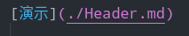
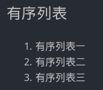

# 1. 关于markdown如何使用

- [1. 关于markdown如何使用](#1-%e5%85%b3%e4%ba%8emarkdown%e5%a6%82%e4%bd%95%e4%bd%bf%e7%94%a8)
  - [1.1. 标题Heading](#11-%e6%a0%87%e9%a2%98heading)
  - [1.2. 粗体、斜体、删除线](#12-%e7%b2%97%e4%bd%93%e6%96%9c%e4%bd%93%e5%88%a0%e9%99%a4%e7%ba%bf)
  - [1.3. 引用](#13-%e5%bc%95%e7%94%a8)
  - [1.4. 代码块](#14-%e4%bb%a3%e7%a0%81%e5%9d%97)
  - [1.5. 链接](#15-%e9%93%be%e6%8e%a5)
  - [1.6. 列表](#16-%e5%88%97%e8%a1%a8)
  
## 1.1. 标题Heading

[演示](./Header.md)


    用 # 来标识标题，一个就代表一级标题，最多六个。使用的时候#与标题中间需要留一个空格

## 1.2. 粗体、斜体、删除线

| 样式   | 语法       | 例子               | 效果             |
| ------ | ---------- | ------------------ | ---------------- |
| 1      | 2          | 3                  | 4                |
| 粗体   | `**`or`__` | `**粗体实例**`     | **粗体实例**     |
| 斜体   | `*`or`_`   | `*斜体实例*`       | *斜体实例*       |
| 删除线 | `~~`       | `~~删除线实例~~`   | ~~删除线实例~~   |
| 粗斜体 | `***`      | `***粗斜体实例***` | ***粗斜体实例*** |

## 1.3. 引用

>我是一段引用

    使用>符号放在前面，例如：
    >我是一段引用

## 1.4. 代码块

```java
public class Main {
    public static void main(String[] args) {
        System.out.println("我是引用块啊");
    }
}
```

## 1.5. 链接

[点我跳转到bing呀](https://www.bing.com)

    [这里放链接的名字](这里放你想要跳转到的链接)，例如：
    [点我跳转到bing呀](https://www.bing.com)

上面这个是绝对路径，这里也是可以使用相对路径的，例如
就是使用的相对路径的md文件

## 1.6. 列表

| 列表类型 | 语法           | 例子          | 效果                                |
| -------- | -------------- | ------------- | ----------------------------------- |
| 有序列表 | 数字小数点空格 | `1. 有序列表` |  |
| 无序列表 | `-`空格        | `- 无序列表`  |   |
